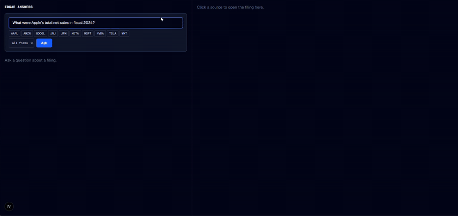

# EDGAR Answers

**A RAG-based Q&A system over SEC filings, with server-verified, click-to-highlight citations.**

> Every answer is grounded in SEC filings, and every citation is verified against the
> source text before it renders. Click any citation to see the exact sentence
> highlighted in the original filing.

Built by Dylan Rogers

## Status

The pipeline is end-to-end and running locally against a ten-company corpus. Not
yet publicly deployed — `docs/deployment.md` is the gap analysis for that, and
`docs/design.md` §12 has the phase plan.

**Working:**

- **Ingestion** — EDGAR fetch (rate-limited, disk-cached), a canonicalizer that
  emits sentence-aligned canonical text and viewer HTML in one pass, financial
  tables indexed one sentence per row, Postgres + pgvector storage.
- **Table column binding** — every numeric table cell is parsed into a record
  with its row label, column label (e.g. `Year Ended › Jan 26, 2025`), scale and
  position, in the same single DOM pass (sentences and viewer HTML stay
  byte-identical; an unsure label is stored as NULL, never guessed). Long tables
  are split into pieces that each carry a context line naming their columns,
  embedded with the piece so a row deep in a table is still findable.
- **Retrieval** — hybrid vector + full-text search fused with Reciprocal Rank
  Fusion, local `bge-small-en-v1.5` embeddings (no API cost).
- **Answering** — `POST /ask` over SSE: an answer streams token-by-token, each
  factual claim carries a marker, and every cited quote is verified server-side
  by deterministic substring match against the cited chunk before its citation
  event is emitted. A failed match renders a visible "unverified" badge rather
  than being dropped.
- **Query decomposition** — a question naming two companies is split, retrieved
  per company, and merged, so a comparison answer draws on both filers (design
  `docs/design.md` §14). Entity and fiscal-period detection resolve which
  filings a question means when no filter is set.
- **Conversation memory** — anonymous, per-browser follow-ups: a follow-up
  question is rewritten to a standalone question before retrieval, and the
  rewrite is shown to the user.
- **Frontend** — a `/ask` split pane: streamed answer and a sources panel
  (citations grouped by filing) on the left, a tabbed filing viewer on the
  right. Clicking a citation opens its filing and scrolls to the exact
  highlighted sentence — or, for a table citation, to the exact cited figure
  inside its row.

**Corpus:** ten large filers (AAPL, MSFT, AMZN, GOOGL, META, NVDA, TSLA, JPM,
JNJ, WMT), 10-K and 10-Q over roughly three fiscal years — 120 filings, 18,698
chunks, 296,316 sentences, 280,770 parsed table cells (95.7% with a column
label).

**Remaining Phase 5 work:** deploying a public demo; the next retrieval lever is
fiscal-period detection (see Evals).

## Demo



A run through the flow: ask an analyst-style question, watch the answer stream
in with inline citation markers, see the sources panel resolve each citation to
a verified quote, then click a citation to open the filing and land on the exact
highlighted sentence. The follow-up ("Did net sales grow in fiscal 2025?") is
rewritten to a standalone question and draws on a second filing.

## Why this project

I wanted hands-on experience with RAG. I chose going after citation trust, 
hallucinations are extremely frustrating, so this system verifies every quote 
against the source filing before showing it, and lets you jump straight to the 
sentence it came from. 

## Architecture

```
EDGAR (submissions, 10-K/10-Q HTML) ─▶ Python ingestion pipeline ─▶ Postgres/pgvector
                                                                          │
                                     Next.js frontend ◀── FastAPI ────────┘
                                     (answer pane + sources panel,
                                      tabbed filing viewer,
                                      click-to-highlight citations)
```

Three units with hard boundaries (`docs/design.md` §3): the **pipeline** writes
Postgres and is never called by the API; the **API** reads Postgres and calls
the LLM and owns verification; the **frontend** talks only to the API. The
pipeline↔API contract is the database schema; the API↔frontend contract is the
HTTP/SSE interface.

The load-bearing idea is that the canonicalizer emits two **aligned** outputs in
a single DOM traversal: canonical text split into sentences with stable integer
ids, and sanitized viewer HTML where each sentence is wrapped in a span carrying
that same id. Verification is then a plain substring match of the model's quote
against the cited chunk's canonical text — no fuzzy matching — and the id it
resolves to is the id the frontend scrolls to. A citation that fails
verification renders a visible "unverified" badge; it is never silently
dropped.

**The query path**, on `POST /ask`:

1. **Resolve targets** — if the request carries no company filter, detect which
   corpus companies (and, when confident, which specific filings) the question
   names. A comparison question naming two companies produces two targets.
2. **Retrieve** — per target, run vector search (pgvector cosine) and full-text
   search (Postgres FTS) and fuse them with Reciprocal Rank Fusion; take the top
   chunks into context. Hybrid is deliberate: financial text is dense with exact
   terms ("ASC 842", "RSUs", "Item 1A") where lexical search beats semantic.
3. **Generate** — one Claude Haiku call. The answer streams to the client;
   the trailing JSON block of `{marker, chunk_id, quote}` citations is buffered
   and parsed when generation finishes.
4. **Verify** — for each citation, normalize the quote and the cited chunk's
   text (Unicode NFKC, quotes, dashes, whitespace, case), require the quote to
   be a substring of the chunk, then map the match back to sentence ids. Emit
   `verified: true` with those ids, or `verified: false` with none.

XBRL is deliberately out of scope for v1, along with 8-Ks and on-demand ticker
ingestion — see `docs/design.md` §2 and the §14 backlog.

## Repo layout

```
backend/        Python ingestion pipeline + FastAPI service
  src/pipeline/   EDGAR fetch → canonicalize → chunk → embed
  src/api/        FastAPI app: target resolution, retrieval, generation, verification
  migrations/     Numbered plain-SQL migrations, applied in filename order
  tests/          Unit tests + canonicalizer fixtures (real messy filing HTML samples)
  evals/          Golden question set + retrieval/faithfulness eval harness
frontend/       Next.js app: answer UI + filing viewer with citation highlighting
  lib/            Framework-free logic: SSE parsing, answer reducer, grouping, tab state
  components/     Thin renderers over lib/
  e2e/            Playwright specs, including click-to-highlight and multi-source
docs/
  design.md            Full technical design document — the authoritative spec
  deployment.md        Pre-deploy gap analysis and hosting options
  superpowers/specs/   Design specs written before a phase starts
  superpowers/plans/   Per-phase implementation plans
```

## Running it locally

Requires Python 3.13, Node 22, and Docker. Those are the versions CI runs
(`.github/workflows/ci.yml`); `requires-python` is pinned to `>=3.13`, and the
old 3.11/3.13 matrix was removed deliberately.

### 1. Configure

```bash
cp .env.example backend/.env         # then fill it in — it is gitignored
```

At minimum set `EDGAR_USER_AGENT` (the SEC rejects requests without an
identifying User-Agent) and, if you want to ask questions, `ANTHROPIC_API_KEY`.
The `DATABASE_URL` default matches `docker-compose.yml`, so it works as shipped.

Backend entry points read `backend/.env` (see `src/pipeline/env.py`); a real
environment variable always wins over a value in the file. Keep
`ANTHROPIC_API_KEY` in that file rather than exporting it — an exported key is
visible to every process on the machine.

### 2. Database

```bash
docker compose up -d --wait          # Postgres + pgvector; --wait blocks until it accepts connections
cd backend
pip install -e ".[dev]"
python -m pipeline migrate
```

### 3. Build the corpus

```bash
python -m pipeline ingest --ticker AAPL    # one company, or --all for all ten
python -m pipeline embed                   # chunk + embed; retrieval returns nothing without this
```

`ingest` fetches and canonicalizes; `embed` is a **separate, required step** —
it chunks the stored filings and writes the vectors that the search half of
retrieval reads. `--ticker` and `--all` are alternatives, not a pair: passing
`--all` ingests every curated company and ignores `--ticker`.

Expect ingestion to take a while and to be polite about it — EDGAR is rate
limited to 5 requests/second. Raw HTML is cached under `backend/data/raw/`, so
re-runs never re-download a filing you already have. Filing *lists* are fetched
live every run; only documents are cached.

### 4. Run it

```bash
python -m uvicorn api.app:app --port 8000   # from backend/

cd ../frontend && npm install
cp .env.local.example .env.local
npm run dev                                 # http://localhost:3000/ask
```

Only answering questions costs money. Ingestion, embedding, and retrieval are
free: embeddings run locally via `fastembed`, so you can build the whole
pipeline and exercise retrieval without an Anthropic key at all.

## Running the tests

```bash
# backend/ — CI runs lint first, and a lint failure skips the tests entirely
ruff check .
pytest -q

# frontend/
npm test          # vitest unit specs
npm run lint
npm run test:e2e  # Playwright; builds the app first, so it typechecks too
```

Database-backed tests are marked `@pytest.mark.db` and **skip silently** unless
`TEST_DATABASE_URL` is set — a skip is not a pass. Point it at a separate
database, which `docker-compose.yml` does not create for you:

```bash
docker compose exec db createdb -U user edgar_answers_test
```

The tests apply migrations themselves, so nothing further is needed. If
Postgres is down while `TEST_DATABASE_URL` is set, pytest blocks in
`psycopg.connect` with no timeout — a hung suite usually means the container
isn't up, not a bad test.

## Evals

The eval harness (`backend/evals/`) is the tuning instrument for every change to
chunking, retrieval, or the prompt — it was built in Phase 2, not bolted on at
the end. The golden set (`golden.yaml`) is 34 hand-checked questions, each
pinned to the filing and the sentence ids where its answer lives:

- 16 single-company questions on Apple 10-Ks and 10-Qs (fiscal 2024–2025);
- 4 rows forming 2 cross-company comparison groups;
- 8 `table_tail` questions (NVDA, MSFT, AMZN, JPM, META, GOOGL, WMT) whose answer
  is a row deep inside a long table;
- 6 `column` questions whose answer is one cell of a multi-period table, each
  with `expected_values` for `value_accuracy`.

```bash
python -m evals run              # retrieval + faithfulness, appends to evals/results.jsonl
python -m evals run --retrieval-only   # skips the model, costs nothing
python -m evals verify           # checks every golden entry still resolves in the DB
```

Each run records the git sha it ran at and whether the tree was dirty, so a row
can be replayed. Run the evals on a clean tree, and run the full eval three
times — the model-dependent metrics move between identical runs.

What the metrics mean:

| metric | Haiku calls? | meaning |
| --- | --- | --- |
| `recall@10` (ticker-scoped) | none | top-10 fused chunks contain a gold sentence, retrieval filtered to the question's own ticker — isolates the retriever |
| `unfiltered_recall@10` | none | same, no filter — what a user gets when no company is detected |
| `targeted_recall@10` | company + period detection | the production retrieval path: detect company and filing, then retrieve |
| `table_tail_recall@10` | none | ticker-scoped recall on the 8 `table_tail` questions |
| `answered_rate`, `verified_rate`, `gold_sid_hit_rate`, `value_accuracy` | period detection + answer | full `/ask` path (the ticker is given, so company detection is skipped): answered, quotes verified, citation lands on the gold sentence, expected figure appears in the answer |

**Latest runs** (git sha 02cfe57 / 570b2cb / 1b9c7f5, table column binding):

| metric | before table column binding (×3) | after (×3) |
| --- | --- | --- |
| `recall@10` | 0.529 | **0.618** |
| `unfiltered_recall@10` | 0.471 | **0.529** |
| `targeted_recall@10` | 0.529 | **0.588–0.618** |
| `table_tail_recall@10` | 0.375 | 0.375 |
| `value_accuracy` | 0.36–0.57 | **0.571** |
| `answered_rate` | 0.71–0.74 | **0.74–0.76** |
| `gold_sid_hit_rate` | 0.41–0.44 | **0.471** |
| `verified_rate` | 0.92–0.975 | 0.89–0.95 |

**How to read this.** Retrieval numbers are deterministic for a given corpus and
query plan; the model-dependent metrics drift between identical runs even at
temperature 0, so they are read as ranges over repeated runs. The biggest
remaining source of misses is **fiscal-period detection**: on the production path
8 of 34 questions are routed to the wrong filing (or none), and retrieval then
searches only that filing. Comparison questions are still weak because a single
query embedding rarely retrieves both companies' figures. One measurement caveat:
a ticker-filtered pgvector query may be planned as an approximate HNSW scan
(filtered after the fact, sometimes returning fewer than 10 rows) or an exact
scan depending on planner statistics, so compare corpora only under the same plan.

## Maintenance commands

```bash
python -m pipeline recanonicalize            # rebuild viewer_html from cached HTML
python -m pipeline recanonicalize --ticker AAPL
python -m pipeline reprocess                  # rebuild sentences, chunks, embeddings (invalidates pinned sids)
python -m pipeline retable                    # parse table cells from cached HTML (refuses if sentences moved)
python -m pipeline table-report               # column-binding coverage: labelled cells, scaled / splittable tables
python -m pipeline rechunk [--ticker T]       # rebuild chunks + embeddings from stored sentences and cells (keeps sids)
```

`recanonicalize` re-runs the canonicalizer over already-cached raw HTML and
updates the stored viewer HTML only — no re-chunk, no re-embed, no EDGAR
traffic. It verifies per filing that the recomputed sentences still match the
stored rows and skips any filing that disagrees, because silently rewriting one
would invalidate every citation already anchored to it. `reprocess` is the
heavier operation that does rebuild sentence ids, so it is paired with
`python -m evals repin` to re-anchor the golden set.

`retable` backfills the column-binding tables (`filing_tables`, `table_cells`)
from cached HTML without touching sentences, chunks or embeddings, and skips any
filing whose recomputed sentences differ from the stored ones. `rechunk` rebuilds
chunks and embeddings from the stored sentences and cells — sids, and therefore
the golden set's pins, are untouched — and is the explicit rebuild after a
chunking change; it embeds locally, so run it per `--ticker` on a
memory-constrained machine. New filings get cells and the current chunking
automatically through `ingest` and `embed`.

## License

MIT
